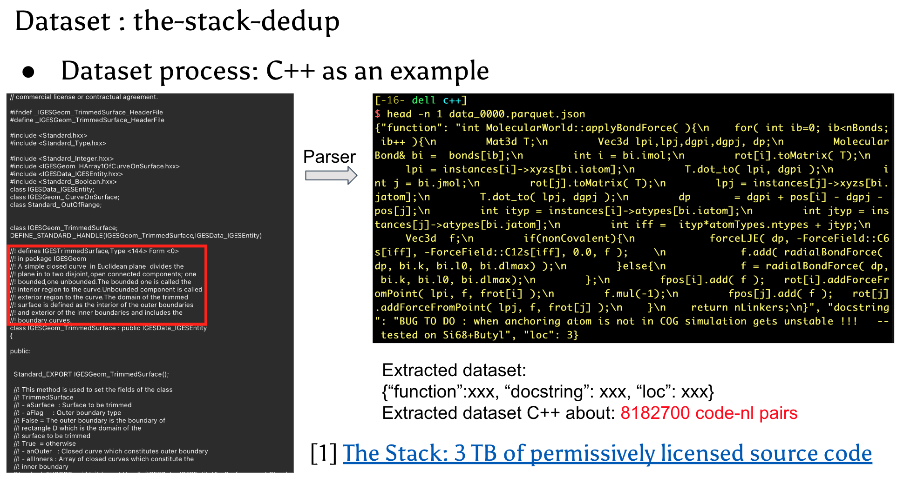

# GraphCodeBERT-based two-stage hash code-to-code search
Implement two-stage hash accurate and efficient code-to-code search based on graphcodebert

#### If you have any questions, How to reach me
```shell
Xin Huang
Email : ishuangxin@hust.edu.cn
WeChat: 13429808852
```

---
#### Script
- Connetct to Node 13
```shell
ssh wanyao@222.20.94.68 -p 50013
```

- Enevoriment
```shell
# conda virtual env
conda activate py37-1.7
```

- Dataset Path
```shell
# origin processed dataset
# C++
/mnt/silver/wucai/code_search/src/target_new/c++
```

- Dataset processed script
```shell
# 构造训练数据的思路是：triplet loss, one positive and one negative
- cpp-negative-construct.py 为所有数据集都随机选一个不重复的负样本
- cpp-train-valid-test.py 按一定比例划分train, valid, test数据集
- graphcodebert-train-valid-test-negative-construct.py 为codebase数据集构造一个负样本
```

- Code Path
```shell
# Without Hashing and Two-Stage
/home/wanyao/huangxin/graphcodebert-cpp

# With Hashing and Two-Stage Faiss
/home/wanyao/huangxin/graphcodebert-cpp-hash
```

- How to Train
```shell
python /home/wanyao/huangxin/graphcodebert-cpp-hash/run.py
--output_dir=./saved_models/cpp-without-dfg-triple-loss-hash
--config_name=microsoft/graphcodebert-base
--model_name_or_path=microsoft/graphcodebert-base
--tokenizer_name=microsoft/graphcodebert-base
--lang=java
--do_train
--train_data_file=/home/wanyao/huangxin/graphcodebert-cpp-hash/dataset/cpp-dataset-split/train_with_negative.jsonl
--eval_data_file=/home/wanyao/huangxin/graphcodebert-cpp-hash/dataset/cpp-dataset-split/valid_with_negative.jsonl
--test_data_file=/home/wanyao/huangxin/graphcodebert-cpp-hash/dataset/cpp-dataset-split/test_with_negative.jsonl
--codebase_file=/home/wanyao/huangxin/graphcodebert-cpp-hash/dataset/cpp-dataset-split/codebase_with_negative.jsonl
--num_train_epochs
10
--code_length
320
--data_flow_length
32
--nl_length
128
--train_batch_size
16
--eval_batch_size
64
--learning_rate
2e-5
--seed
123456
```
- How to Inference
```shell
python /home/wanyao/huangxin/graphcodebert-cpp-hash/run.py
--output_dir=./saved_models/cpp-without-dfg-triple-loss-hash
--config_name=microsoft/graphcodebert-base
--model_name_or_path=microsoft/graphcodebert-base
--tokenizer_name=microsoft/graphcodebert-base
--lang=java
--do_demo
--train_data_file=/home/wanyao/huangxin/graphcodebert-cpp-hash/dataset/cpp-dataset-split/train_with_negative.jsonl
--eval_data_file=/home/wanyao/huangxin/graphcodebert-cpp-hash/dataset/cpp-dataset-split/valid_with_negative.jsonl
--test_data_file=/home/wanyao/huangxin/graphcodebert-cpp-hash/dataset/cpp-dataset-split/test_with_negative.jsonl
--codebase_file=/home/wanyao/huangxin/graphcodebert-cpp-hash/dataset/cpp-dataset-split/codebase_with_negative.jsonl
--num_train_epochs
10
--code_length
320
--data_flow_length
32
--nl_length
128
--train_batch_size
16
--eval_batch_size
64
--learning_rate
2e-5
--seed
123456
```

---
#### Dataset statistics


#### Result
- [Experiment Result Link](https://docs.google.com/spreadsheets/d/1piEynFXIe9i9LCOsZtK1ZkJC0GiD2gh5RfGk5G9NSzw/edit?usp=sharing)
- [PPT Link，from P20 page](https://docs.google.com/presentation/d/1rOhiLsYaX5sV0ljoVbJm0kGi0PuBkpqn-LFMDRyI3UQ/edit#slide=id.g1cccee116f0_3_230)


---
#### C++ Library
- [Faiss to construct Hashing index](https://github.com/facebookresearch/faiss)

#### Reference
- [Deep Code Search](https://ieeexplore.ieee.org/abstract/document/8453172)
- [CodeBERT: A Pre-Trained Model for Programming and Natural Languages](https://arxiv.org/abs/2002.08155)
- [GraphCodeBERT: Pre-training Code Representations with Data Flow](https://arxiv.org/abs/2009.08366)
- [Accelerating Code Search with Deep Hashing and Code Classification](https://arxiv.org/abs/2203.15287)
- R2PS: Retriever and Ranker Framework with Probabilistic Hard Negative Sampling for Code Search (in folder './paper')
- [Efficient Passage Retrieval with Hashing for Open-domain Question Answering
](https://arxiv.org/abs/2106.00882)
- [The Stack: 3 TB of permissively licensed source code](https://arxiv.org/abs/2211.15533#:~:text=Large%20Language%20Models%20(LLMs)%20play,for%20code%20understanding%20and%20generation.)